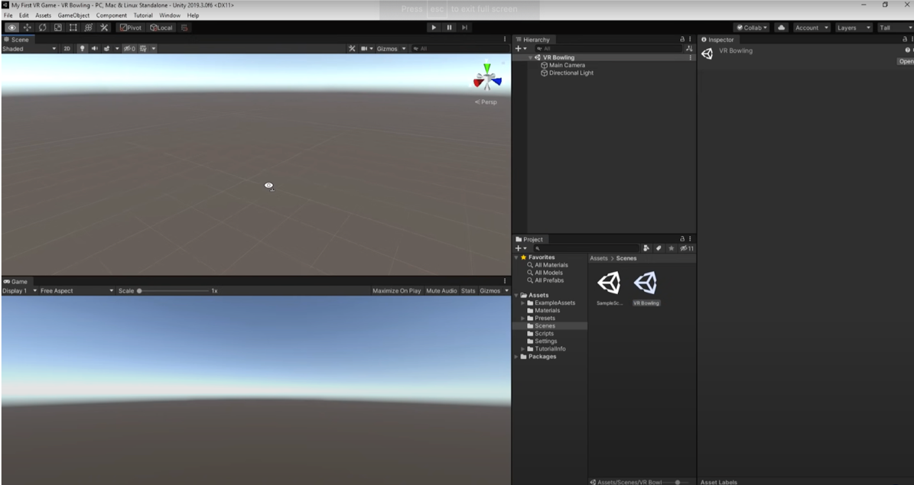
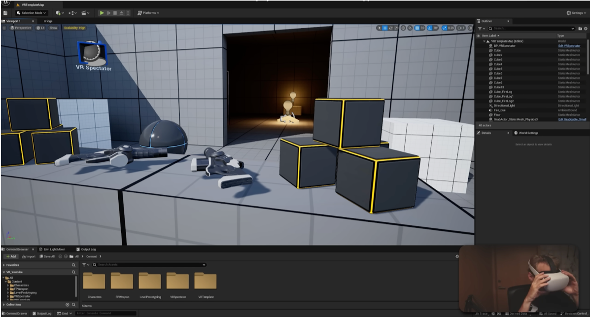
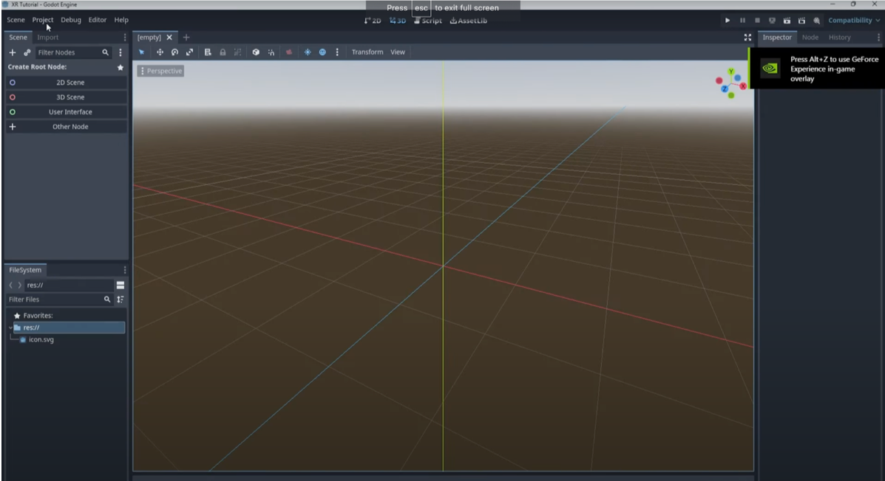
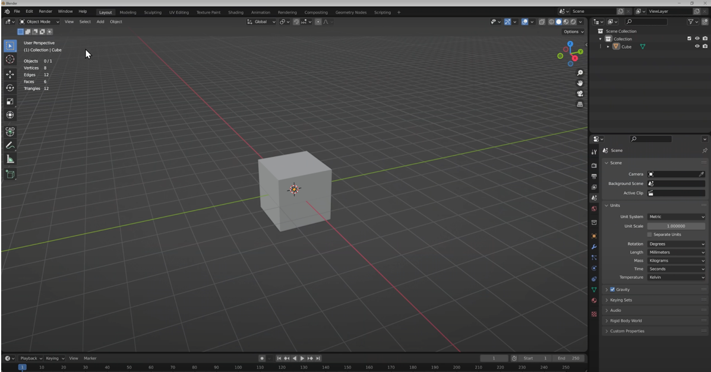
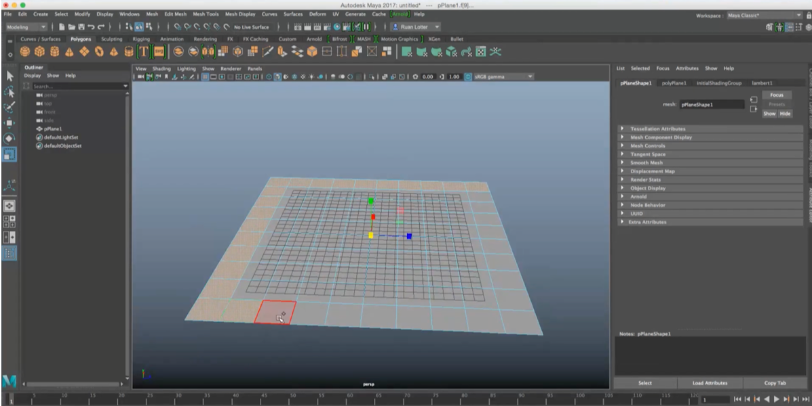
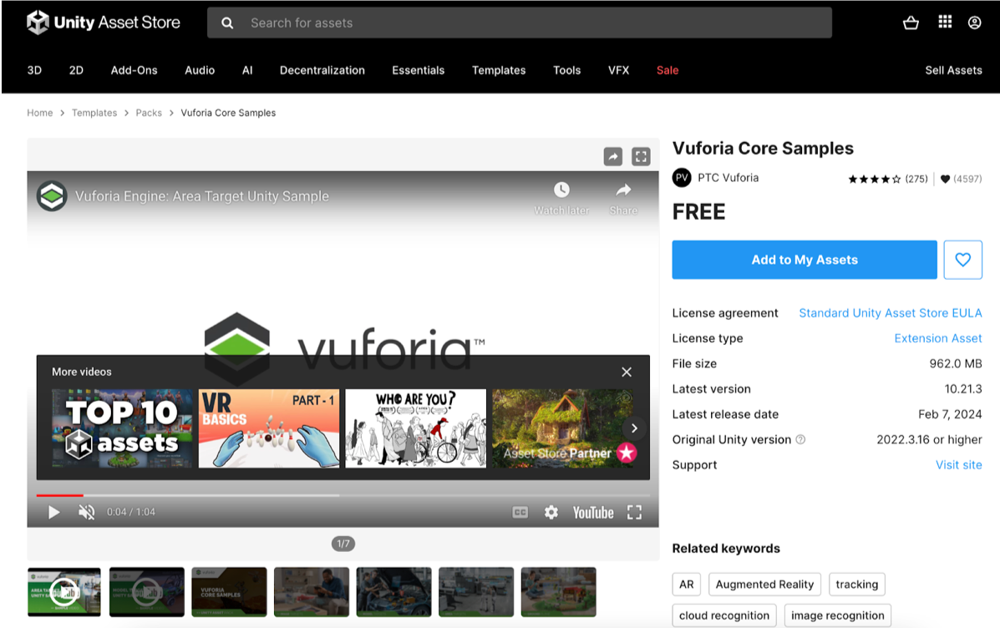

# Project Background

Traditional forms of instruction have prevailed for a considerable duration, yet with the advent of technological advancements, novel educational methodologies - VR (Virtual Reality) and AR (Augmented Reality) instruction - have emerged. Contrary to conventional teaching paradigms, VR/AR pedagogies are student-centered, augmenting student engagement and the allure of knowledge to learners, thereby enhancing instructional and learning outcomes.

Our project aims to create a simple tool for teachers and learners to quickly build VR and AR learning experiences without the specialized skills needed. We plan to start with a basic platform that lets users design 3D educational spaces with interactive elements. The goal is to  make VR and AR content development accessible to educators, fostering innovation and engagement through ease of use.

Initially, the platform will allow basic 3D environment creation, compatibility with various media types, interactive environment, and character customization. In future updates, we will add complex media support, sound effects, advanced animations, multiplayer support, character design, NPC interaction, and stylistic flexibility.

## Literature Review on VR/AR in Education

Compared with traditional 2D education platforms, virtual reality education platforms not only improve learning efficiency but also significantly reduce the workload of teachers and instructors (Horváth, I, 2018). Not only that, AR/VR systems have many benefits, including engagingly presenting educational content, enhancing student motivation and interest, and better understanding complex concepts. These technologies also promote collaborative learning and help overcome learning barriers. However, implementing AR/VR as an educational tool still faces many challenges, such as high costs, insufficient simulation realism, health issues, and so on (Ardiny, H, 2018). Taking accessing 3D graphics on the web as an example, although the web already supports rich media types such as images, 2D graphics, audio, and video, it still lacks 3D graphics (Jankowski, J, 2013).

At present, some institutions have integrated immersive technology into virtual vocational training, providing personalized training opportunities for young people with disabilities, and using VR technology to transport them to virtual control rooms, enabling them to achieve virtual control processes (Mekacher, L, 2019). Not only in education, but people also hope that AR, VR, and MR technologies can be widely promoted in nursing and healthcare (Hsieh, M. C, 2018).

### Reference
Horváth, I. (2018, August). Evolution of teaching roles and tasks in VR/AR-based education. In 2018 9th IEEE International Conference on Cognitive Infocommunications (CogInfoCom) (pp. 000355-000360). IEEE.

Ardiny, H., & Khanmirza, E. (2018, October). The role of AR and VR technologies in education developments: opportunities and challenges. In 2018 6th rsi international conference on robotics and mechatronics (icrom) (pp. 482-487). IEEE.

Hsieh, M. C., & Lee, J. J. (2018). Preliminary study of VR and AR applications in medical and healthcare education. *J Nurs Health Stud*, 3(1), 1.

Jankowski, J., & Hachet, M. (2013, May). A survey of interaction techniques for interactive 3D environments. In Eurographics 2013-STAR.

Mekacher, L. (2019). Augmented Reality (AR) and Virtual Reality (VR): The future of interactive vocational education and training for people with handicap. *International Journal of Teaching, Education and Learning*, 3(1), 118-129.

## Competitive Analysis of Existing VR/AR Learning Platforms

### Objective:
  To evaluate existing VR/AR learning platforms and tools to understand their features, usability, and how they serve their users.

### Activities:

* Compile a list of current VR/AR platforms used for educational purposes (e.g., Immersive VR Education, Engage, Google Expeditions).
* Analyze these platforms based on ease of use, content creation capabilities, interactive features, and the skill level required for educators to create content.
* Identify strengths and weaknesses in these platforms to find potential areas your project could improve upon or innovate within.

#### Google Expeditions

- **Ease of Use:** Designed for educators, Google Expeditions offers a user-friendly interface with pre-built educational content.
- **Content Creation:** Limited content creation options as it primarily focuses on pre-made virtual field trips and experiences.
- **Interactive Features:** Limited interactivity, mainly focused on guided tours and exploration.
- **Strengths:** Accessible for educators and students, offers a wide range of pre-existing educational content.
- **Weaknesses:** Lack of customization options and limited interactivity compared to other platforms.

#### CoSpaces Edu

- **Ease of Use:** CoSpaces Edu provides a simple drag-and-drop interface suitable for educators and students.
- **Content Creation:** Allows for easy creation of 3D environments, animations, and interactive elements without coding.
- **Interactive Features:** Supports interactive elements like quizzes, animations, and simulations.
- **Strengths:** User-friendly interface tailored for education, collaborative features for group projects.
- **Weaknesses:** Limited advanced features compared to more robust game engines like Unity and Unreal Engine.

#### ZSpace

- **Ease of Use:** ZSpace provides an intuitive interface with specialized hardware for immersive AR experiences.
- **Content Creation:** Primarily focuses on pre-existing educational content and experiences, limited content creation tools.
- **Interactive Features:** Offers interactive simulations and educational experiences tailored for specific subjects.
- **Strengths:** Specialized hardware for immersive experiences, curated educational content.
- **Weaknesses:** Limited customization options and content creation capabilities compared to more versatile platforms.

#### Nearpod

- **Ease of Use:** Nearpod's VR lessons are designed to be user-friendly for educators,   providing intuitive tools for creating and delivering immersive content within the platform.
- **Content Creation:** Nearpod offers a variety of content creation capabilities for VR lessons, including customizable scenes, interactive elements, and multimedia integration. Educators can easily create engaging VR experiences tailored to their lesson objectives and students' needs.
- **Interactive Features:** Nearpod VR lessons excel in interactivity, allowing students to actively engage with 450 + ready to run VR lessons through features such as clickable hotspots, 3D models, quizzes, and collaborative activities. This interactivity enhances student participation and comprehension.
- **Strengths:** Nearpod VR lessons are accessible and versatile, offering educators a wide range of interactive tools and content customization options. The platform empowers educators to create immersive learning experiences that cater to diverse learning styles and subject areas.
- **Weaknesses:** While Nearpod provides robust content creation capabilities, mastering these tools may require some initial training or familiarity with virtual reality technology. Additionally, although Nearpod offers extensive interactive features, some educators may desire even greater flexibility and customization options to tailor VR lessons to specific learning objectives.

### Areas for Improvement/Innovation:

* Simplifying content creation tools for educators with limited technical skills.
* Offering a balance between ease of use and advanced functionalities.
* Enhancing interactivity and customization options for creating immersive learning experiences.
* Providing comprehensive educational resources and templates to facilitate content creation.
* Integrating collaborative features for group projects and classroom activities.

## Technology Exploration

### Game Engines

#### Unity

- **Supported Programming Languages:** C#

- **Supported Platforms:**
  - PC (Windows, macOS, Linux)
  - Consoles (PlayStation, Xbox, Nintendo Switch)
  - Mobile devices (iOS, Android)
  - Web platforms (WebGL)
  - Augmented Reality (AR) devices (such as ARKit and ARCore supported devices)
  - Virtual Reality (VR) devices (Oculus Rift, HTC Vive, PlayStation VR, etc.)
  - Mixed Reality (MR) devices (Microsoft HoloLens)

- **Supported Dimensions:** 2D, 3D
  
- **Pros and Cons:**

  <table>
    <tr align="center">
      <th>Pros</th>
      <th>Cons</th>
    </tr>
    <tr align="left">
      <td><b>User-Friendly:</b> Unity provides an intuitive interface and tools suitable for beginners and non-programmers</td>
      <td><b>Performance Issues:</b> May encounter performance issues when handling complex scenes and high-fidelity graphics</td>
    </tr>
    <tr align="left">
      <td><b>Cross-Platform Support:</b> Supports multiple platforms including PC, mobile devices, and VR headsets</td>
      <td><b>Steep Learning Curve:</b> While Unity is beginner-friendly, mastering advanced features and best practices requires more time and experience</td>
    </tr>
    <tr align='left'>
      <td><b>Abundant Resources:</b> Offers a vast asset store with various 3D models, audio, and scripting resources</td>
      <td></td>
  </table>

- **Interface:**

  
  
  https://www.youtube.com/watch?v=gGYtahQjmWQ&t=454s

 

#### Unreal Engine
  

- **Supported Programming Languages:** C++

- **Supported Platforms:**
  - PC (Windows, macOS, Linux)
  - Consoles (PlayStation, Xbox, Nintendo Switch)
  - Mobile devices (iOS, Android)
  - Web platforms (HTML5)
  - Augmented Reality (AR) devices (ARKit, ARCore)
  - Virtual Reality (VR) devices (Oculus Rift, HTC Vive, PlayStation VR, etc.)
  - Supported Dimensions: 2D, 3D

- **Pros and Cons:**

  <table>
    <tr align="center">
      <th>Pros</th>
      <th>Cons</th>
    </tr>
    <tr align="left">
      <td><b>Graphics Quality:</b> Offers high-fidelity graphics and advanced rendering features suitable for projects requiring high-quality visual effects</td>
      <td><b>Steep Learning Curve:</b> Compared to Unity, Unreal Engine has a steeper learning curve, requiring more time and effort investment</td>
    </tr>
    <tr align="left">
      <td><b>Blueprint Visual Scripting:</b> Allows non-programmers to create complex game logic and interactions through the blueprint system</td>
      <td><b>Large Installation Footprint:</b> Unreal Engine’s installation package is large, requiring more storage space and processing power</td>
    </tr>
    <tr align="left">
      <td><b>Community Support:</b> Has a large community and rich documentation resources, facilitating learning and issue resolution</td>
      <td></td>
  </table>

- **Interface:**

  

  https://www.youtube.com/watch?v=wqjJU4V6bGM

 

#### Godot

- **Supported Programming Languages:** GDScript

- **Supported Platforms:**
  - PC (Windows, macOS, Linux)
  - Mobile devices (iOS, Android)
  - Web platforms (HTML5)
  - Consoles (limited console support compared to Unity)

- **Supported Dimensions:** 2D, 3D

- **Pros and Cons:**

  <table>
    <tr align="center">
      <th>Pros</th>
      <th>Cons</th>
  </tr>
    <tr align="left">
    <td><b>Lightweight:</b> Compared to Unity and Unreal Engine, Godot has a smaller installation footprint and faster startup</td>
    <td><b>Relatively Limited Ecosystem:</b> Compared to Unity and Unreal Engine, Godot has fewer assets stores and community resources</td>
  </tr>
    <tr align="left">
    <td><b>DScript Visual Scripting:</b> Uses the GDScript language for scripting, which is easy to learn and use</td>
    <td><b>Limited Features:</b> While Godot provides basic game development features, it may lack some advanced functionalities compared to other engines</td>
  </tr>
    <tr align="left">
    <td><b>Open Source and Free:</b> Godot is an open-source and free game engine suitable for individual developers and small teams</td>
    <td></td>
  </table>

- **Interface:**

  

  https://www.youtube.com/watch?v=shbHGhkh4NM

 

### VR/AR Content Creation Tools and Technologies

#### 3D Modeling Software

- **Blender**

  - lender is a free and open-source 3D creation suite that supports modeling, rigging, animation, simulation, rendering, compositing, and motion tracking.
  - It's widely used for creating 3D assets for VR and AR applications.
  
   
  

  https://www.youtube.com/watch?v=ZrXAEsYiIyE

- **Autodesk Maya**

  - Maya is a popular 3D modeling and animation software used in film, television, and game development.
  - It offers powerful tools for modeling, texturing, rigging, animation, and rendering.
  
   
  
  
  https://www.youtube.com/watch?v=q4RK77jspvU

- **Asset Libraries**

  - [Unity Asset Store](https://assetstore.unity.com/)
  - [TurboSquid](https://www.turbosquid.com/)
  - [Sketchfab](https://sketchfab.com/)

 

#### AR Development Kits

- **[Vuforia](https://developer.vuforia.com/)**

  - An augmented reality platform that provides tools and SDKs for developing AR applications.
  - Offers features such as image recognition, object tracking, and occlusion, making it suitable for various AR experiences.

   
  

  https://assetstore.unity.com/packages/templates/packs/vuforia-core-samples-99026

- **[ARKit](https://arkit.com.au/)**

  - Apple's AR development framework for iOS devices.
  - Provides features like motion tracking, scene understanding, and light estimation.

- **[ARCore](https://developers.google.com/ar)**

  - Google's AR platform for Android devices.
  - Offers similar features to ARKit.

- **[Spark AR Studio](https://spark.meta.com/)**

  - A tool provided by Facebook for creating augmented reality effects and experiences for Facebook and Instagram
  - It’s widely used for developing AR filters, lenses, and interactive AR content for social media platforms.

 

### Frameworks and APIs

<table>
  <tr align="center">
    <th></th>
    <th>Pros</th>
    <th>Cons</th>
</tr>
  <tr align="left">
    <td>Unity3D</td>
    <td>Widely used, extensive documentation, robust VR/AR features, cross-platform development</td>
    <td>Steep learning curve, scripting in C#, resource-intensive</td>
</tr>
  <tr align="left">
    <td>Unreal Engine</td>
    <td>Powerful graphics, built-in VR/AR tools, visual scripting with Blueprints</td>
    <td>Steep learning curve, requires 3D design knowledge, may require powerful hardware</td>
</tr>
  <tr align="left">
    <td>Vuforia</td>
    <td>Specializes in AR, easy-to-use features, no-code option (EasyAR), extensive documentation</td>
    <td>Limited capabilities compared to Unity/Unreal, may not be suitable for complex VR experiences</td>
</tr>
  <tr align="left">
    <td>Google ARCore and Apple ARKit</td>
    <td>Native AR development, motion tracking, environmental understanding</td>
    <td>Primarily focused on AR, limited to mobile devices, constrained by mobile hardware capabilities</td>
</table>
