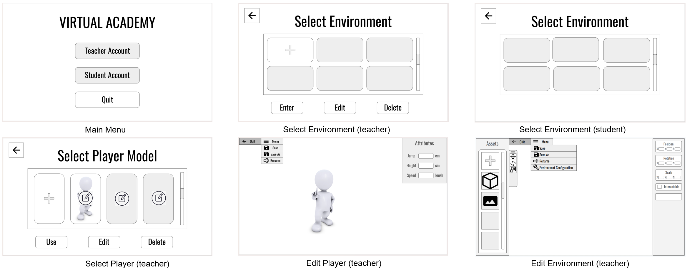

# Process of Designing the Low Fidelity Prototype

## Objective
The objective of our process for designing the low fidelity prototype is to effectively illustrate the functionality and user interaction of our Virtual Learning Experience Builder (VLEB) through clear, concise, and realistic scenarios. The design aims to fully encapsulate client expectations and provide an accurate representation of the system's capabilities.

## Choice of Technique
After brainstorming, comparison and discussion, we planned to use an innovative method to build our low-fidelity prototype: using slides. Using the button's link to jump to different pages can achieve navigation logic and provide a user-operable interface. Here is our comparison and justification.

### Comparison with Paper Prototypes

#### **Advantages of Slides:**
- **Easily Editable:** Unlike paper prototypes, slides can be quickly edited and updated without needing to redraw or physically alter components.
- **Shareability:** Slides can be shared electronically with remote team members or stakeholders, facilitating broader and more efficient feedback loops compared to physical paper prototypes that are limited to in-person sessions.

#### **Disadvantages of Paper Prototypes:**
- **Limited Interactivity:** Paper prototypes offer minimal interactivity, which can restrict the ability to simulate user interactions effectively.
- **Time-consuming Revisions:** Making changes to a paper prototype often requires significant manual rework, which can slow down the iteration process.

### Comparison with Digital Prototypes Made from Figma

#### **Advantages of Slides:**
- **Lower Technical Barrier:** Creating slide-based prototypes does not require the same level of technical skill as Figma, making it accessible to team members who may not have experience with advanced design tools.
- **Quick Setup:** Slides allow for a faster setup of basic layouts and flows, ideal for initial ideation phases where the focus is more on concept validation than high-fidelity detailing.

#### **Disadvantages of Digital Prototypes:**
- **Complexity:** Figma prototypes, while highly interactive and closer to the final product, can be overly complex for early stages of design, potentially leading to delays in obtaining initial feedback.
- **Resource Intensive:** Using Figma requires more resources in terms of both hardware capabilities and software knowledge, which might not be justifiable for simple prototyping needs.

In conclusion, choosing slides for low-fidelity prototyping offers a balance between ease of use, speed, and effective communication of design concepts. It suits early-stage development where rapid iteration and broad accessibility are more critical than the depth of interaction detail provided by tools like Figma.

## Steps in the Design Process

### Understanding User Stories and Client Requirements:
- Begin by revisiting the user stories and client requirements to ensure a deep understanding of the necessary functionalities and desired outcomes.
- Select at least four user stories that cover diverse aspects of the system to showcase a comprehensive range of functionalities.

### Sketching:
- Create initial sketches for each selected user story. These sketches aim to map out the basic layout and flow of interactions in the VLEB.
- Focus on the logical sequence of actions that a user would take to complete each task, ensuring that the steps are intuitive and aligned with how users are expected to interact with the system.

### Incorporating Realistic Data:
- Integrate realistic data into the prototype designs to simulate true-to-life scenarios that users might encounter.
- This involves creating examples of data inputs and outputs that will be visible on the prototype screens, enhancing the authenticity of the user interaction experience.

### Iterative Feedback and Refinement:
- Conduct internal reviews of the sketches with the project team to gather feedback and make initial adjustments.
- Where possible, consult with the client or potential end-users to gather early feedback on the usability and relevance of the sketched designs.

### Creating the Low Fidelity Prototype:
- Translate the refined sketches into a more structured low fidelity prototype using tools suitable for creating wireframes such as Balsamiq, Sketch, or simple drawing tools.
- Ensure that the prototype clearly demonstrates the navigation, interaction, and task completion processes outlined in the user stories.

### Consistency Check:
- Review the prototype to ensure that it is consistent with the client's understanding of the problem and aligns with other project artifacts.
- Confirm that the prototype adheres to design principles and maintains uniformity in style, language, and interaction patterns across all screens.

### Quality Control and Presentation Preparation:
- Proofread all text elements to eliminate typos or spelling errors.
- Prepare clear and organized presentation materials that outline how each part of the prototype addresses specific user stories and client needs.

### Prototype Presentation:
- Prepare task scenarios that will guide the demonstration of the prototype to the client.
- These scenarios should be well-written, organized, and directly tied to the user stories to help validate the usability and effectiveness of the system.

## Final Version of Low-Fidelity Prototype
After the prototype presentation and usability test, we gathered and analysed feedback from the client to identify improvements, and updated the prototype based on prioritized changes.

The interface name with ‘(teacher)’ means this is only for teacher account, name with ‘(student)’ means this is only for student account. The navigation logic can be operated in the LF_Prototype.pptx.

 
 

## Appendix

### The Iteration of Low Fidelity Prototype

#### Environment-Edit Layout Iteration
In the first version of our environment-edit interface, the asset bar and object control bar were both in the right side. The object control was mainly done by a button click. After a discussion with the client, the client suggested us to put the asset bar on the left side of the screen, in order to save the user's effort when operating. In the second version, we intended to simplify the operation to control the object. The objects were entirely controlled by clicking buttons. However, this approach loses the accuracy, we need to find a more precise way to control the object. Besides, the client wants the operation logic similar to mainstream 3D modelling software. Hence, we referred to the Unity platform and altered our operation logic. Users can drag different axes to control the object's position, rotation and size. At the same time, the user can also input numbers in the attributes bar to control the object precisely. Apart from that, we also altered our menu settings, to make the interface more concise and extendable.

#### Player-Edit Layout Iteration
In the old version of our player-edit interface, we designed to control the user's speed, jump height, height, shape and gender. After the meeting with the client, we considered the project scope and necessarily, decided to remove two functions: shape and gender customization. We also adjusted the menu bar to make the interface more concise. 

#### Navigation Logic Iteration
We simplified the navigation logic to make the system more user-friendly. Besides, the new operation logic imported a fault-tolerance mechanism. When selecting the environment, the user needs to click two buttons. This can prevent the user click the wrong environment and wasting time for waiting loading.

### Future Functions of Our Project
We designed several practical functions for our project. However, when considering the scope and feasibility of this project, we decided to not implement these functions in our project. Instead, we put them into the future development plan.

