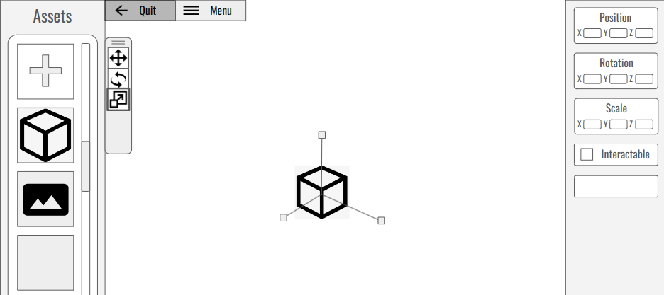
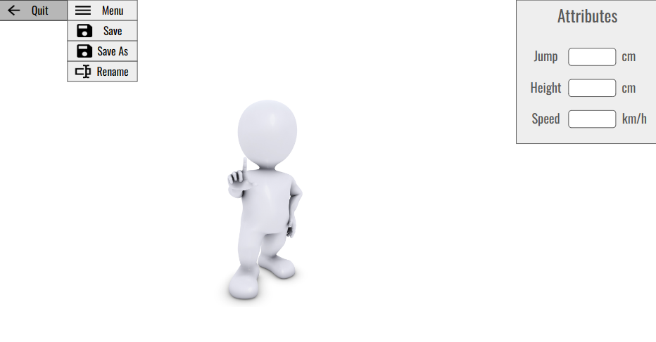
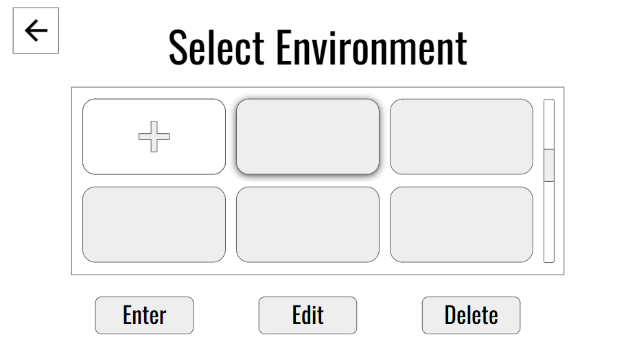

# **Usability test script**

## Introduction

This document is used to describe our work during the Usability test, which includes the test environment, roles, tasks, survey, feedback and chnages.

Our test involves participants interacting with slides to complete tasks given by us. The slides are low-fidelity prototypes created by our team based on user stories to roughly showcase our software product. Users can interact by tapping buttons, swiping, or entering text directly on the slides. Our staff will respond to participant actions, such as changing to the next slide when a button is clicked to simulate page transitions. These procedures are documented in the speech and will be explained to participants before the testing begins.

## Test Environment

|**Location/URL**|**Equipment**|**Used for**|
| :- | :- | :- |
|Face to face test:old metalurgy, room 131, building 166. |PowerPoint in Computer |Testing tool|
||Phone|Recording the test|
||Two Hand-Made Squares|Testing tool|

## Roles

|**Role**|**Assigned to:**|
| :- | :- |
|Facilitator|Yinuo Li|
|Human Computer|Shanqing Huang |
|Observer|Tianyi Zhong and Keang Lyu |

## USABLILITY TASKS

### Task 1 scenario

**As** a teacher,

**I want to** create a new 3D environment,

**So that** I can use this 3D environment in the classroom to aid teaching.

**Related user story id:** U2.5, U1.1, U1.5, U3.1

#### **Task 1:** Creating a Customized Learning Environment and a new character with 3D Model Integration.

#### Instructions

1. Choose to be a Teacher on the Homepage.
1. Choose to create a new environment.  
1. Choose to create a new player character.
1. Save this character.
1. Select this character and “Enter” the environment.
1. Save this environment as ‘First Environment’.

### Task 2 scenario

**As** a teacher,

**I want to** edit a 3D environment,

**So that** I can make this 3d environment fit into what I'm teaching

**Related user story id:** U1.3, U1.4, U1.5, U5.1, U5.6

#### **Task 2:**  Create new objects in the environment, and manipulate this object to move, change size and rotate.

#### Instructions

1. Select an exist environment to “Edit”.
1. Select an exist character and “Enter”
1. Place a cube into the environment.
1. Manipulate this cube to move, change size and rotate (We're going to demonstrate this part with a real object)
1. Select the image from asset.
1. Drag it into the environment.
1. Save this environment.

### Task 3 scenario

**As** a teacher,

**I want to** edit the character of an environment,

**So that** I can limits the ability of the character in this 3d environment.

**Related user story id:** U3.1, U3.2, U3.3, U3.4

#### **Task 3:** Select an environment and edit the Character’s Size and His/her Motion of this environment.

#### Instructions

1. Select an exist environment to “Edit”.
1. Select an exist character and “Edit”.
2. Edit the attributes of this character.
1. Save the change of this character.

### Task 4 scenario

**As** a student,

**I want to** join in the environment and walk freely in this environment,

**So that** I can understand the content of this lecture.

**Related user story id:** U2.5, U4.1, U4.2, 

#### **Task 4**: Choose to become a student and join in an exist 3D environment, try to move around in the environment.

#### Instruction

1. Choose to be a student at the Home page.
2. Select an environment to enter.
3. move around in the environment.

### Task 5 scenario

**As** a student,

**I want to** interact with the environment,

**So that** I can understand the content of this lecture.

**Related user story id:** U4.5, U6.1, 

#### **Task 5:** Control the player to move and interact with the object within the 3D environment.

**Instruction:**

1. Contral the player to move toward the “Image” object.
1. Click the “Watch” button below the image.
1. Close the image.

## Survey

Considering the number of participants, we plan to use a survey format to collect feedback from testers, which will be used to analyze if there are any deficiencies in our software.

### Questions

1. Between the two versions we provided, which one do you prefer?
   1. Please give us a reason.

1. During the test, whether you are confused about any of the tasks?

1. During testing, did you feel there was a logical problem with a particular task?

1. How difficult or easy did you find it to complete these tasks? (Rate from 1 to 5. 1 means very difficult)
   1. If you rate 1 or 2, what was the biggest difficulty you encountered?

1. How do you feel our current layout? Do you think any part of the layout is unreasonable?

1. If so, could you specify which How likely do you think it is to make an error in operation?
   1. If there are any particular steps where you feel it's easy to make a mistake, please specify which step.

1. What do you think our software needs to improve?

Survey Link: <https://peaspqtu7ze.typeform.com/to/YsanX2gj>

## FeedBack

After completing the usability test, we systematically recorded the performance and interactions of the participants throughout the test session. Additionally, we meticulously gathered direct feedback from the participants regarding the product being tested. This data includes not only their responses to the functionality of the product but also their evaluations of its usability, interface design, and overall user experience. These valuable insights will provide clear guidance to help us improve our product in subsequent development phases, ensuring it better meets user needs and expectations.

### Performance

In this test, there were a total of five scenarios, and the participants encountered minimal obstacles during the testing process. The only exception was during the first task, which involved creating a new character, where participants experienced some confusion. Although the correct buttons were clicked, the PowerPoint presentation did not register the action, leading to a temporary stall. Aside from this issue, the usability aspects of the test did not present any significant problems. The participants nearly perfectly completed the test, with the exception of the PowerPoint detection issue.

### Comments

Although the test did not encounter major issues, participants provided several valuable suggestions for improvements to our low-fidelity prototype:

1. **Highlight Selections**: Participants suggested highlighting the selected character on the "Select Player Mode" page and the environment on the "Select Environment" page. This would visually indicate the user's current choices. Consistency in highlighting styles across these selections is also recommended.
2. **Interaction Modification**: On the "Select Player Mode" page, a two-step interaction process was proposed: users should first click on a 'character' and then on an 'Edit' button, rather than having a direct transition upon selecting a character.

3. **Numeric Adjustments**: In addition to direct manipulation for adjusting an object's rotation, location, and scale, users can also make precise adjustments by entering specific values. For example, entering the number 45 in the rotation field will rotate the object by 45 degrees. Furthermore, users can set whether the object is interactive to further customize its behavior.

4. **Object Interactions**: Like images or videos, these should be able to adhere to surfaces such as a cube's side, enhancing the integration of multimedia elements with 3D objects.

5. **Enhanced Media Interaction**: When interacting with images or videos, such as clicking 'watch', the media should enlarge in front of the character while other menus retract. It's crucial that the image remains floating in front of the user and that the user can activate the view without directly facing the image, perhaps by clicking 'watch' or pressing a specific key.

6. **Menu Interface Clutter**: The current menu interface is perceived as too cramped. It was suggested to introduce a compact icon that users can click to reveal desired actions, rather than having all options displayed on the page simultaneously. This would streamline the user interface and enhance usability by reducing visual clutter.

## Changes

In response to the feedback received, we have made several revisions to our low-fidelity prototype:

1.**Object Manipulation**: We have updated the functionality for manipulating objects by adding the ability to adjust scale, rotation, and position through numeric input. Additionally, we have incorporated a checkbox to set whether an object is interactable, enhancing user control over object properties.

2.**Menu Interface**: Operations previously listed directly in the menu have been relocated to an icon in the left-right corner. Clicking this icon now reveals a dropdown menu with selectable actions, streamlining user interactions.

3.**Highlighting and Editing Errors**: The issues with highlighting and editing players were due to errors in the PowerPoint presentation. These have now been corrected.

4.**Media Interaction**: Demonstrating character-media interactions effectively in PowerPoint was challenging. These interactions will be more accurately represented in the high-fidelity prototype.

## Videos

This video showcases the process of conducting a usability test. Due to its original length of 30 minutes and large file size, we have edited it down to focus exclusively on the testing process. The full version of the video also includes segments on participant feedback and tests of another version of the product.

### Task 1

https://github.com/SWEN90009-2024/VL-RedBack/assets/142132507/ae781f0a-5e71-4808-a337-6922590f9a3c

### Task 2

https://github.com/SWEN90009-2024/VL-RedBack/assets/142132507/d76dde9d-f2b1-4d90-9495-83994e9506fd

### Task 3

https://github.com/SWEN90009-2024/VL-RedBack/assets/142132507/4b37976e-d88f-4f87-b318-a29d8874ec89

### Task 4&5

https://github.com/SWEN90009-2024/VL-RedBack/assets/142132507/cca31b72-fd29-4fa9-8898-c485024fae9c

Full Video Link: <https://unimelbcloud-my.sharepoint.com/personal/keangl_student_unimelb_edu_au/_layouts/15/stream.aspx?id=%2Fpersonal%2Fkeangl%5Fstudent%5Funimelb%5Fedu%5Fau%2FDocuments%2FSRA%2FMeeting%20Recordings%2FClient%20Meeting%2D2024%2D05%2D01%2Emp4&ga=1&referrer=StreamWebApp%2EWeb&referrerScenario=AddressBarCopied%2Eview%2E4ea593c6%2D703c%2D4c92%2D8d79%2D19365b6a41b2>
